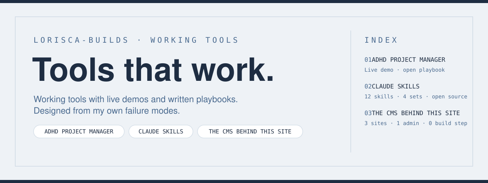

Working tools with live demos and written playbooks. Designed from my own failure modes.

The rule: no card without a live demo and a written playbook.

---

## Shipped

<table>
<tr>
<td width="60%" valign="top">

### ADHD Project Manager

A scheduled scan that catches everything I leave midway across AI chats and lands it on one prioritized board. Built for my ADHD; built so anyone can repurpose it.

**Live demo · open playbook**

[Repo](https://github.com/lori-sca/muse-adhd-project-manager) · [Live demo](https://lori-sca.github.io/muse-adhd-project-manager/board/index.html)

</td>
<td width="40%" valign="top">

</td>
</tr>
</table>

<table>
<tr>
<td width="60%" valign="top">

### Claude Skills

Twelve skills I built for Claude, each from a failure I got tired of repeating. Four sets: finding what I already figured out, keeping decisions between chats, building ML notebooks that hold up, and catching costly errors.

**12 skills · 4 sets · open source**

[Repo](https://github.com/lorisca-builds/lori-claude-skills) · [Start with cross-project-extraction](https://github.com/lorisca-builds/lori-claude-skills/tree/main/cross-project-extraction)

</td>
<td width="40%" valign="top">

</td>
</tr>
</table>

<table>
<tr>
<td width="60%" valign="top">

### The CMS behind this site

My portfolio runs on plain HTML and JSON — and I edit every word of it from a custom admin panel, no developer needed.

**3 sites · 1 admin · 0 build step**

[Repo](https://github.com/lori-sca/lori-sca.github.io) · [Live site](https://lori-sca.github.io)

</td>
<td width="40%" valign="top">

</td>
</tr>
</table>

---

<i>More tools are in the workshop — each one earns its card here when it has a live demo and a written playbook.</i>

---

## All repos

<!-- REPOS:START -->
- [lori-claude-skills](https://github.com/lorisca-builds/lori-claude-skills) — Twelve Claude skills built from real failures — knowledge retrieval, session handoff, ML notebook workflow, and small gu…
<!-- REPOS:END -->

---

<a href="https://lori-sca.github.io">Personal site</a> ·
<a href="https://lorisca-analytics.github.io">Analytics Work</a> ·
<a href="https://lorisca-builds.github.io">Builds</a> ·
<a href="https://lori-sca.github.io/about.html">About</a> ·
<a href="mailto:loriscatuuk@gmail.com">Email</a> ·
<a href="https://www.linkedin.com/in/lorisca">LinkedIn</a> ·
<a href="https://github.com/lorisca-builds">GitHub</a>

